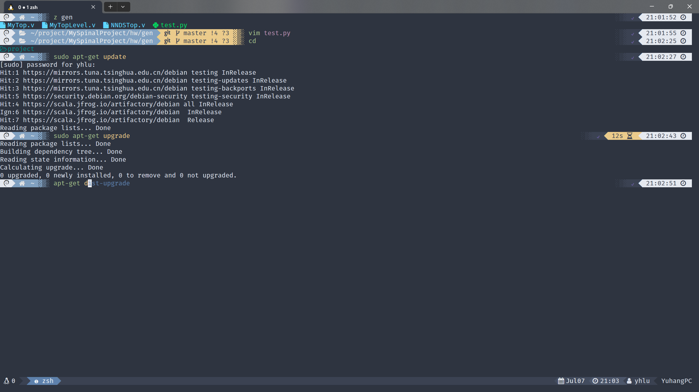
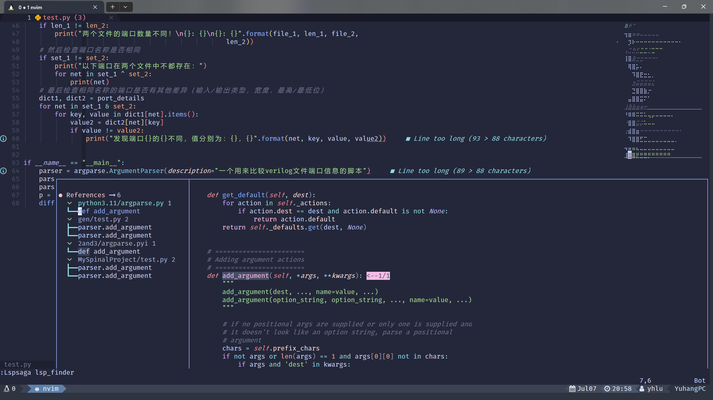

# YH's dotfiles

## Install

Run ./install.sh to make symbolic link.

## Zsh

## Tmux

Migrated from [gpakosz's .tmux](https://github.com/gpakosz/.tmux)

## Neovim

Migrated from [ayamir's nvimdots](https://github.com/ayamir/nvimdots)
Notice: Neovim >= 0.9 and no support for vim yet
