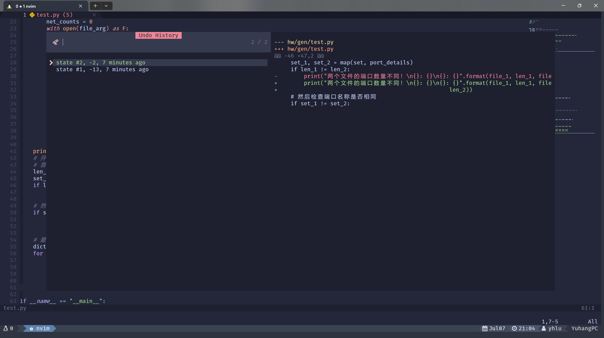

# YH's dotfiles

## Install

Run ./install.sh to make symbolic link.

Including configuration for zsh/tmux/neovim

## Prerequisites

### Neovim

lazygit ripgrep zoxide sqlite fd yarn nerd-fonts lldb make unzip

### zsh

fzf zoxide exa bat nerd-fonts

## Zsh

## Tmux

Migrated from [gpakosz's .tmux](https://github.com/gpakosz/.tmux)

## Neovim

Migrated from [ayamir's nvimdots](https://github.com/ayamir/nvimdots)
Notice: Neovim >= 0.9 and no support for vim yet

## Other Recommand Tool

ripgrep
: replace for grep  
fd
: replace for find  
dust
: sort file by size  
bat
: replace for cat  
atuin
: CLI history search  
zoxide
: smarter cd command  
ouch
: easier compress and decompress  
htop
: better top  
exa
: better ls  
fzf
: fuzzy file finder
git-delta
: better git diff  
procs
: better ps  
less
: better more
